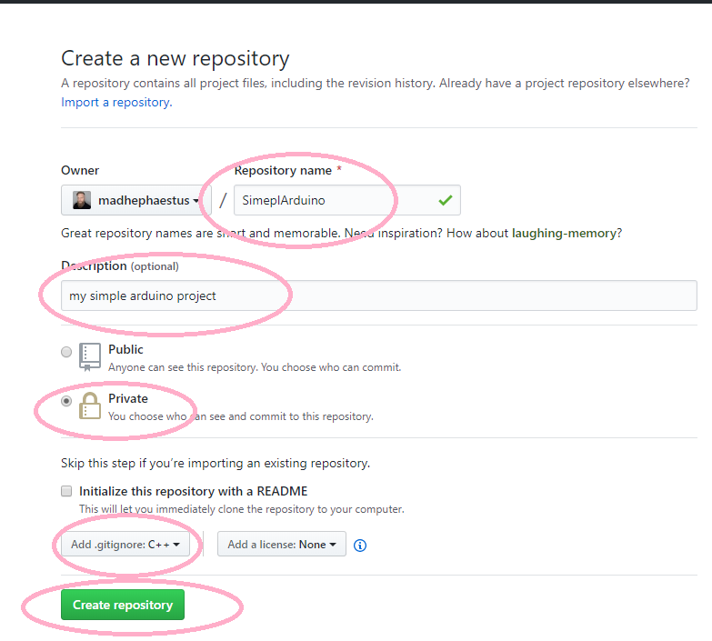
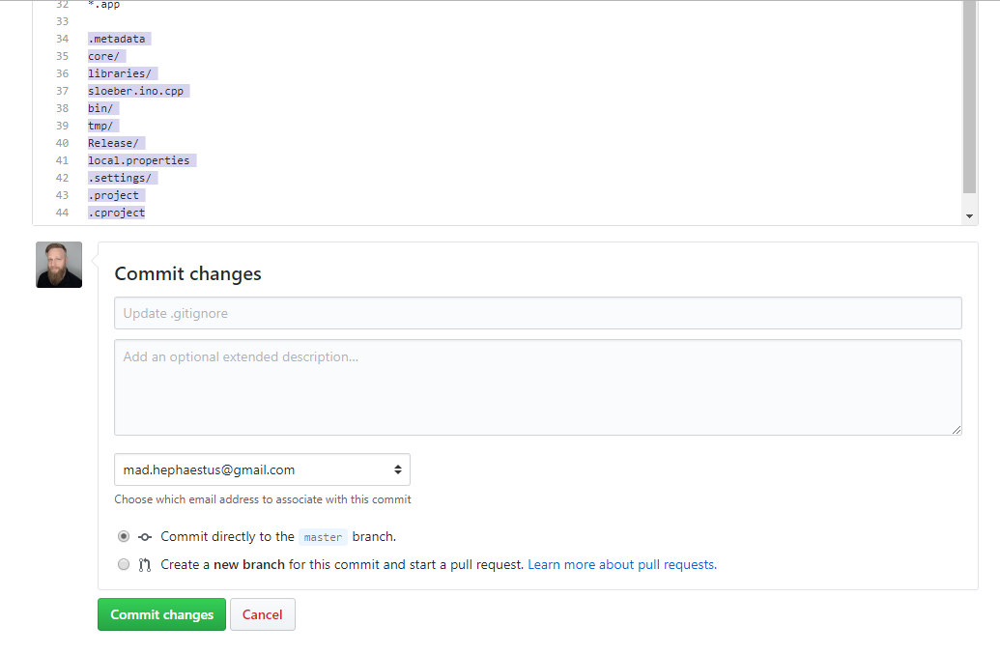
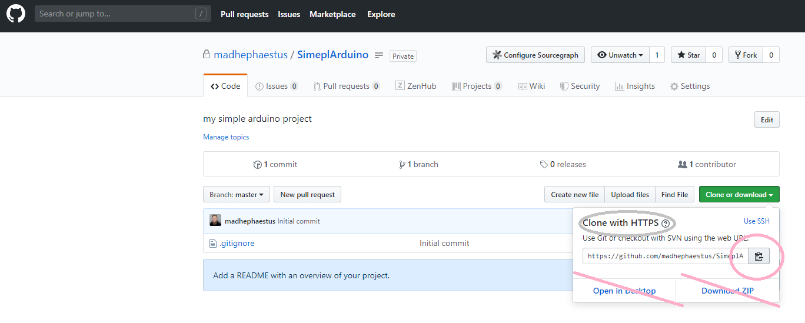
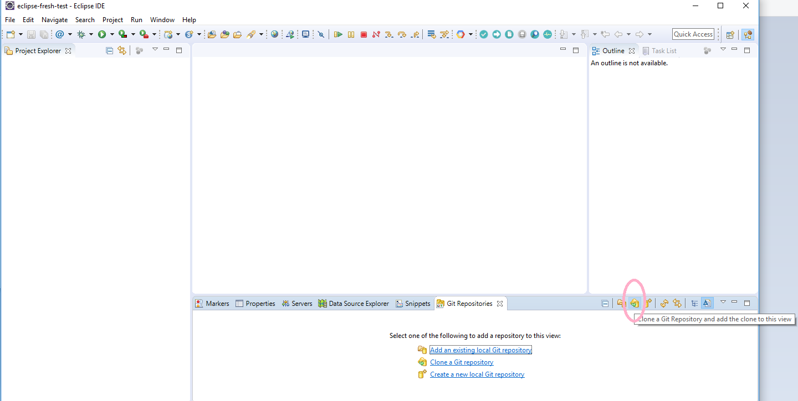
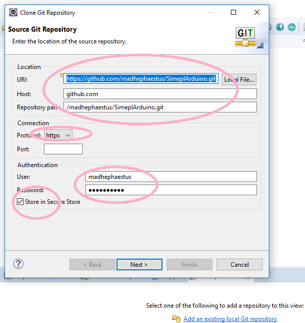
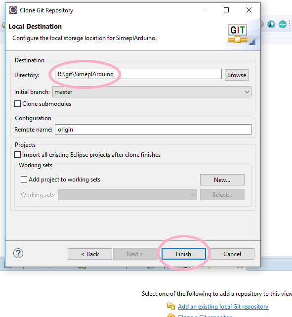
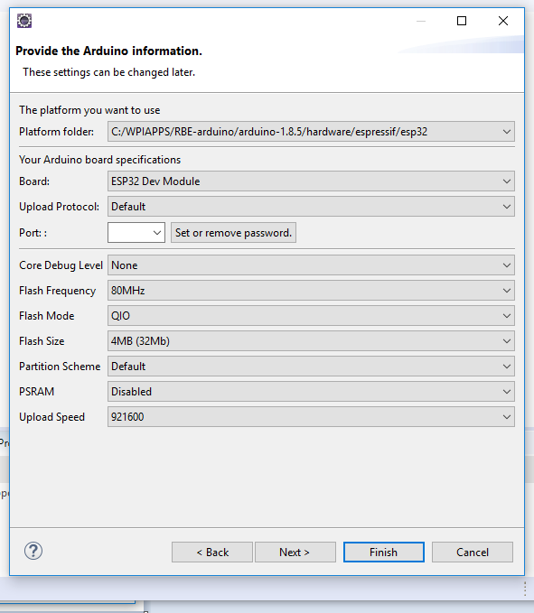
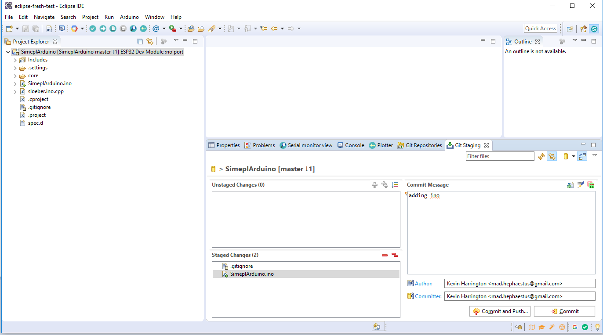
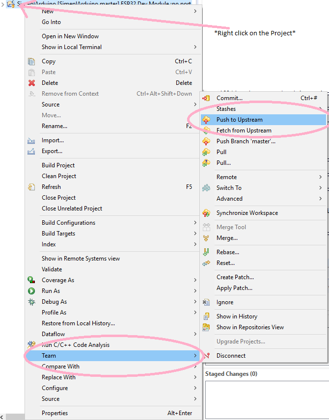

# Create a fresh, Private repository In the Github.com Browser



# Edit .gitignore to Ignore project files

Edit the .gitignore file in the repo


Add these lines: 

   ```
   .metadata
   core/
   libraries/
   sloeber.ino.cpp
   bin/
   tmp/
   Release/
   local.properties
   .settings/
   .project
   .cproject
   ```


Hit commit changes.

# Clone the repository










# Create new Arduino sketch


	



# Commit .ino and .gitignore files

	


# Push changes

	



